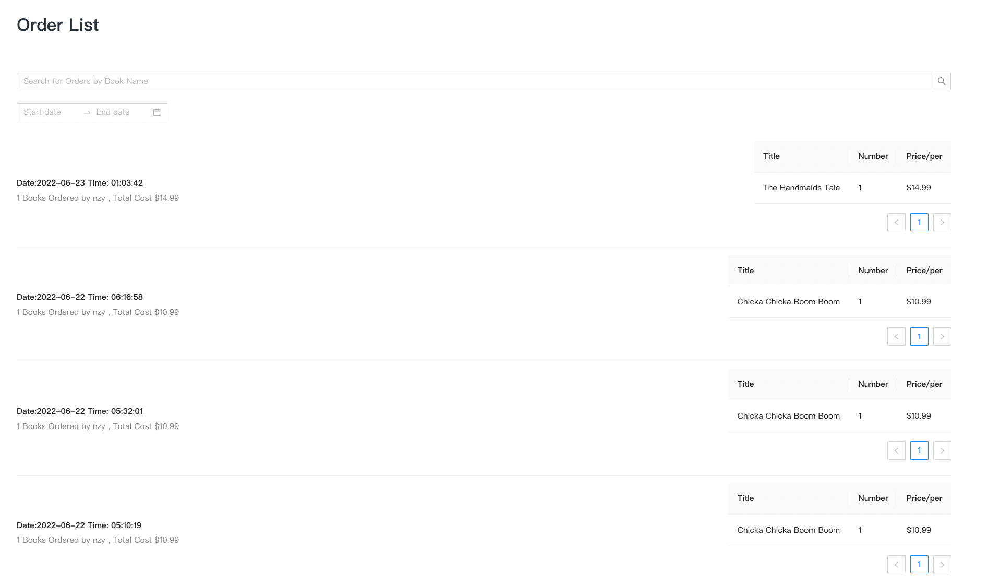

# E-Bookstore (React + Spring Boot)

A full-stack online bookstore web application where users can browse, search, and purchase books, while admins can manage inventory and users. Built with React (frontend), Spring Boot (backend), and MySQL (database).

---

## 🚀 Demo

Screenshots:

- Login  
- Register  
- Home  
- Search Book  
- Book Detail  
- Cart  
- Checkout  
- Order Record  
- User Manage  
- Book Manage  
- User Sales Rank  
- Book Sales Rank  

---

## ✨ Features

### Customer
- Register, Login, Logout
- Browse and search books
- View book details
- Add to cart, update cart
- Checkout and place orders
- View order history

### Admin
- Manage users (ban/unban)
- Manage books (add/edit/delete)
- View user sales rank
- View book sales rank

---

## 🛠️ Tech Stack

- **Frontend:** [React](https://reactjs.org/), [Ant Design](https://ant.design/)
- **Backend:** [Spring Boot](https://spring.io/projects/spring-boot), Hibernate (JPA)
- **Database:** [MySQL](https://www.mysql.com/)
- **API:** Fetch API

---

## 📁 Project Structure

```
Online-Ecommerce-Bookstore-main/
│
├── bookstore_backend/      # Spring Boot backend
│   ├── src/
│   ├── pom.xml
│   └── ...
│
├── bookstore_frontend/     # React frontend
│   ├── src/
│   ├── package.json
│   └── ...
│
├── assets/                 # Screenshots for documentation
├── bookstore.sql           # Database schema and seed data
└── README.md
```

---

## 🏁 Getting Started

### 1. Clone the repository
```bash
git clone <repo-url>
cd Online-Ecommerce-Bookstore-main
```

### 2. Database Setup (MySQL)
- Create a database named `bookstore` in MySQL.
- Import the schema and seed data:
  ```bash
  mysql -u <username> -p bookstore < bookstore.sql
  ```
- Update your MySQL username and password in `bookstore_backend/src/main/resources/application.properties`:
  ```properties
  spring.datasource.username=YOUR_USERNAME
  spring.datasource.password=YOUR_PASSWORD
  ```

### 3. Backend Setup (Spring Boot)
- Go to the backend directory:
  ```bash
  cd bookstore_backend
  ```
- Build and run the backend:
  ```bash
  ./mvnw spring-boot:run
  # or on Windows
  mvnw.cmd spring-boot:run
  ```
- The backend will start on [http://localhost:8088](http://localhost:8088)

### 4. Frontend Setup (React)
- Open a new terminal and go to the frontend directory:
  ```bash
  cd bookstore_frontend
  npm install
  npm start
  ```
- The frontend will start on [http://localhost:3000](http://localhost:3000)

---

## ⚙️ Environment Variables

Backend (`application.properties`):
- `spring.datasource.url=jdbc:mysql://localhost:3306/bookstore`
- `spring.datasource.username=YOUR_USERNAME`
- `spring.datasource.password=YOUR_PASSWORD`
- `server.port=8088`

Frontend: No custom environment variables required by default.

---

## 📚 API Endpoints (Sample)

- `POST /api/login` - User login
- `POST /api/register` - User registration
- `GET /api/books` - List/search books
- `GET /api/books/:id` - Book details
- `POST /api/cart` - Add to cart
- `POST /api/order` - Place order
- ... (see backend code for full list)

---

## 🙌 Contributing

Pull requests are welcome! For major changes, please open an issue first to discuss what you would like to change.

---

## 📄 License
